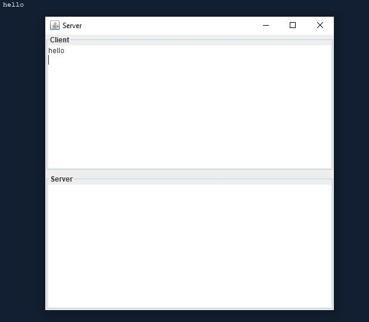

# Chat

Write a program that enables two users to chat. Implement one user
as the server (Figure 31.21a) and the other as the client (Figure 31.21b). The
server has two text areas: one for entering text and the other (noneditable) for
displaying text received from the client. When the user presses the Enter key,
the current line is sent to the client. The client has two text areas: one (noneditable) for displaying text from the server and the other for entering text. When
the user presses the Enter key, the current line is sent to the server.

## Example Output

This image will display as your example output. Name the image README.jpg in your project folder.



## Analysis Steps

Well I analyzed the requirements of the program by looking at the pearson text web files, I first looked at the program
description was to create a client side and a servide chat box, on each side of a Interface so that one side, either
the client or the server can type text and when you press enter the text is sent to the other chat box, making it so either
the client or server receive a message. All of the info I needed to create these boxes was in the chapter 31 section, as well as
referring to my knowledge of past programs.

### Design

How did you approach your program design? Did you use multiple classes to define various objects?

```
Give examples
```

### Testing

A step by step series of examples that you developed to properly test the program. 

Say what the step will be

```
Give the example
```

And repeat

```
until finished
```

End with an example of getting some data out of the system or using it for a little demo

## Notes

No notes, simply run the program to test it out by entering text and pressing enter.

## Do not change content below this line
## Adapted from a README Built With

* [Dropwizard](http://www.dropwizard.io/1.0.2/docs/) - The web framework used
* [Maven](https://maven.apache.org/) - Dependency Management
* [ROME](https://rometools.github.io/rome/) - Used to generate RSS Feeds

## Contributing

Please read [CONTRIBUTING.md](https://gist.github.com/PurpleBooth/b24679402957c63ec426) for details on our code of conduct, and the process for submitting pull requests to us.

## Versioning

We use [SemVer](http://semver.org/) for versioning. For the versions available, see the [tags on this repository](https://github.com/your/project/tags). 

## Authors

* **Billie Thompson** - *Initial work* - [PurpleBooth](https://github.com/PurpleBooth)

See also the list of [contributors](https://github.com/your/project/contributors) who participated in this project.

## License

This project is licensed under the MIT License - see the [LICENSE.md](LICENSE.md) file for details

## Acknowledgments

* Hat tip to anyone who's code was used
* Inspiration
* etc
